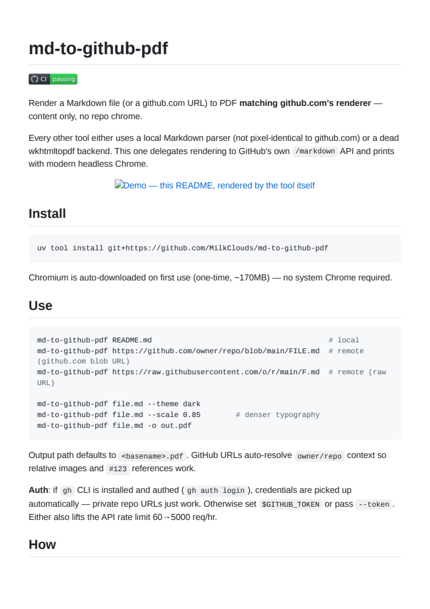

# md-to-github-pdf

[](https://github.com/MilkClouds/md-to-github-pdf/actions/workflows/ci.yml)

Render a Markdown file (or a github.com URL) to PDF **matching github.com's renderer** — content only, no repo chrome.

Every other tool either uses a local Markdown parser (not pixel-identical to github.com) or a dead wkhtmltopdf backend. This one delegates rendering to GitHub's own `/markdown` API and prints with modern headless Chrome.

### Demo

Below is **this very README**, rendered by `md-to-github-pdf` — no manipulation, just the tool's output:

<p align="center">
  
</p>

## Install

```bash
uv tool install git+https://github.com/MilkClouds/md-to-github-pdf
```

Chromium is auto-downloaded on first use (one-time, ~170MB) — no system Chrome required.

## Use

```bash
md-to-github-pdf README.md                                        # local
md-to-github-pdf https://github.com/owner/repo/blob/main/FILE.md  # remote (github.com blob URL)
md-to-github-pdf https://raw.githubusercontent.com/o/r/main/F.md  # remote (raw URL)

md-to-github-pdf file.md --theme dark
md-to-github-pdf file.md --scale 0.85        # denser typography
md-to-github-pdf file.md -o out.pdf
```

Output path defaults to `<basename>.pdf`. Relative image paths resolve against the source's location — local images are embedded into the PDF, remote ones are fetched — and GitHub URLs auto-resolve `owner/repo` context for `#123`/`@user` references.

**Auth**: if `gh` CLI is installed and authed (`gh auth login`), credentials are picked up automatically — private repo URLs just work. Otherwise set `$GITHUB_TOKEN` or pass `--token`. Either also lifts the API rate limit 60→5000 req/hr.

## How

`md` → GitHub `/markdown` API (`mode=gfm`) → `github-markdown-css` + `highlight.js` + Twemoji SVGs → Playwright's bundled Chromium `page.pdf()`.

GFM extensions — `> [!NOTE]` alerts, `- [x]` task lists, tables, footnotes, emoji shortcodes — all handled by the API, so the output is byte-identical to what github.com renders.

## Limits

- Network required (GitHub API + jsDelivr CDN)
- Mermaid blocks not rendered (github.com page-level feature, outside `/markdown` API)
- Unauthenticated rate limit: 60 req/hr (use `GITHUB_TOKEN` for 5000)

## License

MIT
